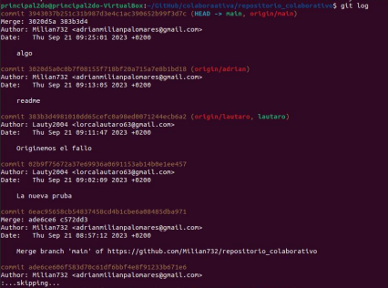

# *Segunda parte de la tarea: Trabajo por parejas*

## Hecho por Adrian y Lautaro

1. Crear Repositorio
    - Repositorio Colaborativo
2. Generar Conflicto
    - modificación de Lautaro
    - modificación de Adrian
3. Resolución del Conflicto
    - gestion del conflicto
    - usar la version adecuada por las dos partes
4. Historial de commits desde consola y github
    - uso de git log
    - historial desde github

### **1. Crear un repositorio**
---

Yo cree el repositorio llamado "repositorio_colaborativo" y invité a Lautaro.

Desde el github de Lautaro tambien está el repositorio.

Luego de hacer el repositorio tuvimos que clonar el repositorio a nuestro local

### **2. Trabajar por parejas sobre este repositorio creando ramas y haciendo commits sobre el mismo fichero generando que aparezca un conflicto.**
---

Ahora empieza lautaro creando archivos y subiendolos al remoto (aclaramos que el usuario 
principal2do es sobre la maquina de lautaro)

Lo siguiente fue crear un fichero README en remoto para probar un pull a la local de 
lautaro(principal2do)

 *En la captura ya sale con un contenido editado porque durante el proceso lo editamos *

 

 

 Durante el proceso creé el archivo lautaro.txt y lo subí a la remota y despues hice pull para 
 quede mi local igualada a la remota tanto como lo hizo lautaro

La proxima captura se refiere a lo mismo pero justo sale la creacion y subida de otro archivo llamado "**deprueba.txt**"

Ahora, creamos nuestras ramas particulares en local y las subimos a remoto tambien, Lautaro creo una rama llamada lautaro y yo hice una rama llamada Adrian con **git branch**

lo siguiente que hicimos fue fusionar (**git merge**) las ramas a la main pero solo para probar, esto no nos dio ningún problema.

### **3. Gestión y resolución del conflicto**
---

Para generar el conflicto decidimos editar el fichero README cada uno en su rama,yo añadí una línea que ponia "esto no debe dar error" y lautaro en el suyo puso "Originemos el fallo",procedimos a subirlo a remoto y luego la fusionamos con el main.

Primero fusiona Lautaro su rama con la main

Luego la fusiono yo con la main.

Todo lo que nosotros hicimos fue entrar a nuestras ramas modificar el fichero y subirlo a remoto.

posteriormente tuve que hacer un pull para tener la misma version del repositorio que lautaro

ahora llegamos al conflicto cuando quiero hacer un push de mi main local a remoto ya que en remoto esta lo que Lautaro habia pusheado con el README editado

En la proxima captura vemos el git status con el error bien claro que tenemos y tambien un cat al fichero README

Para arreglar el problema nos pusimos de acuerdo en que el de Lautaro era la version correcta y cambie mi contenido al de él

Una vez arreglado el problema hago un **git push**

Posteriormente Lautaro hace un **git pull** para ver que ya tenemos el mismo contenido.

### **4. Mostrar cómo aparece el historial de commits con las fechas y los autores, tanto desde consola como desde github**
---

Para mostrar los commits, fecha y autor hemos utilizado el comando **git log**, el cual muestra todos los commits realizados en el repositorio y de parte de quien viene y en que fecha

Tambien hemos puesto captura de la interfaz gráfica de los commits desde github.

enlace externo de prueba:

[Github](https://github.com/)